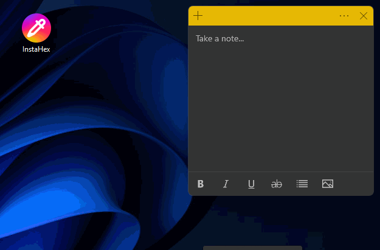

# InstaHex

Simple color picker for grabbing colors from screen.

[](https://github.com/Sakhnovkrg/InstaHex/releases/latest)



## Features

- Click tray icon to pick a color from anywhere on screen
- Magnifying glass for precise pixel selection
- Copies HEX color to clipboard automatically
- Launch at startup option
- Lightweight, runs in system tray

## Usage

1. Click the tray icon to start picking
2. Move the magnifier to select a pixel
3. Click to copy the HEX color to clipboard
4. Press Escape to cancel

## Build

```bash
npm install
npm run build:win
```

## Development

```bash
npm run dev
```

## License

MIT
